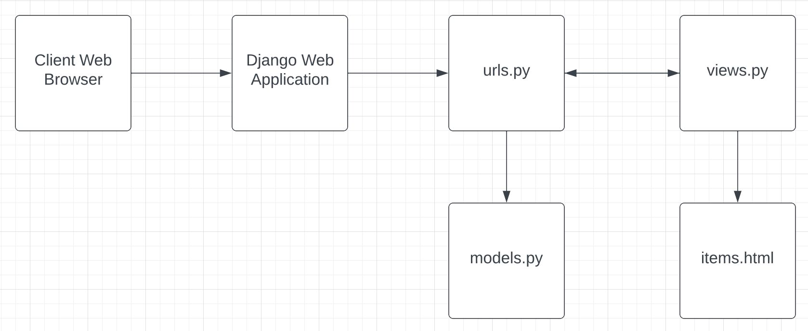
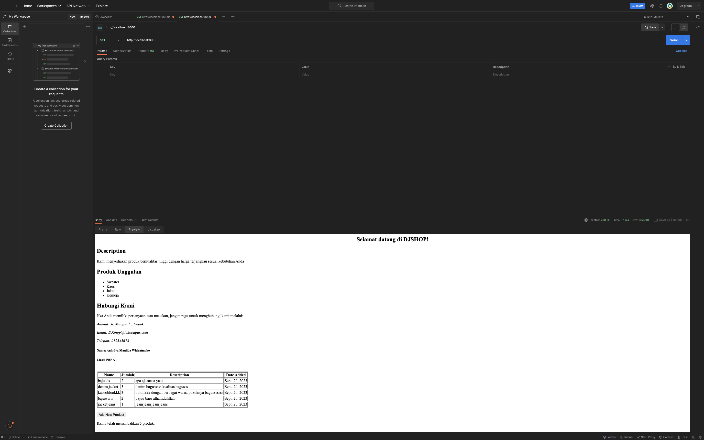
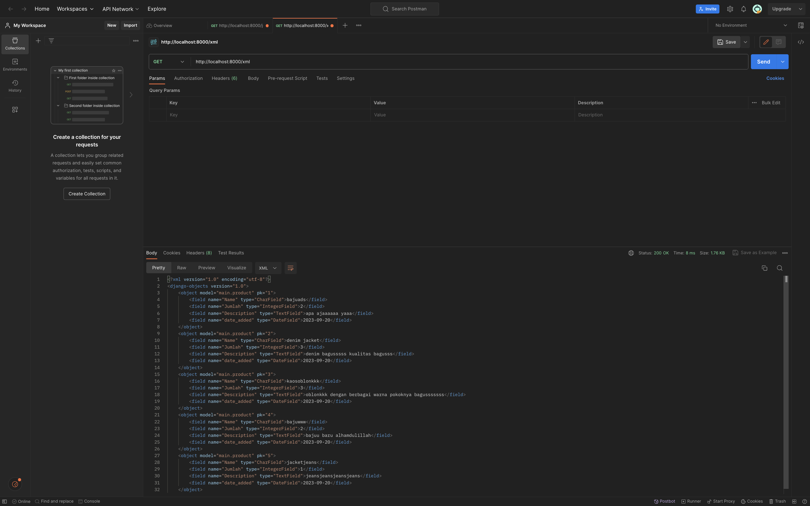
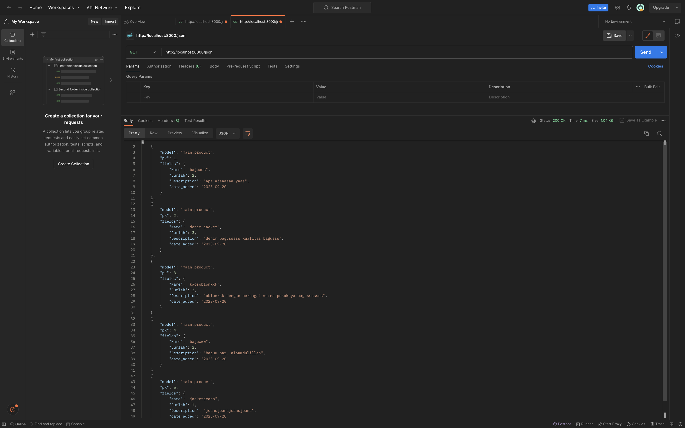
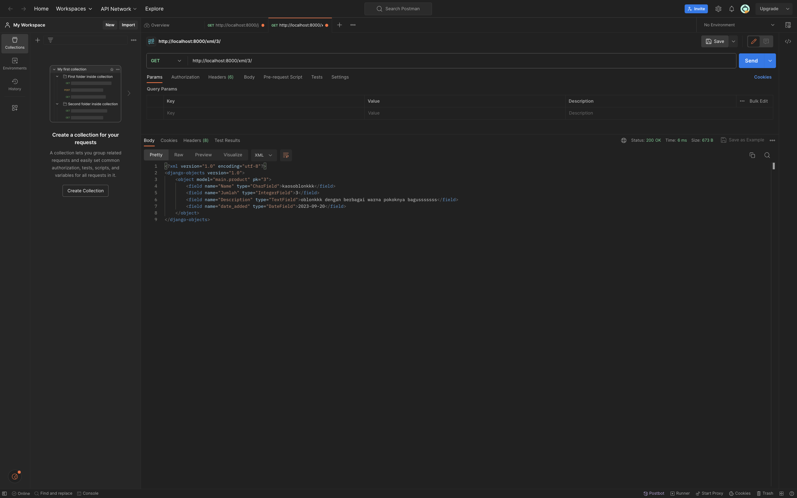
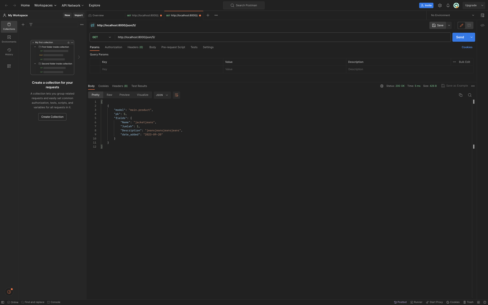

Link Adaptable: https://djshopdea.adaptable.app/main/

=================Tugas 2================================

1. Jelaskan bagaimana cara kamu mengimplementasikan checklist di atas secara step-by-step (bukan hanya sekadar mengikuti tutorial). 

    1. Membuat Proyek Django Baru:
    Pertama adalah membuat proyek Django baru
    saya membuat proyek Django untuk membangun toko dengan memberi nama proyek ini "DJShop" untuk membuat direktori baru dengan menggunakan perintah berikut di terminal:
    
    django-admin startproject DJSHOP

    2. Membuat Aplikasi "main":
    Setelah proyek dibuat, saya membuat aplikasi dengan nama "main" untuk membuat direktori "main" yang akan berisi kode aplikasi yang akan dibuat dengan menggunakan perintah berikut:
    ```
    python manage.py startapp main
    ```

    3. Melakukan Routing:
    Untuk menjalankan aplikasi "main", kita perlu mengkonfigurasi routing. Untuk itu buka file `urls.py` pada direktori proyek DJSHOP kemudian tambahkan path untuk "main" ke dalam aplikasi seperti ini dengan tujuan untuk mengarahkan permintaan ke dalam "main":
    ```python
    from django.urls import include, path

    urlpatterns = [
        path('', include('main.urls')),
    ]
    ```
    
    4. Membuat Model "Item":
    Selanjutnya, di dalam direktori "main", buka file `models.py` dan definisikan model "Item" dengan atribut yang diberikan seperti kode berikut untuk mewakilkan entitas "Item" dengan atribut yang telah ditentukan:
    ```python
    from django.db import models

    # Create your models here.
    class Product(models.Model):
        Name = models.CharField(max_length=255)
        Kelas = models.CharField(max_length=255)
        Produk = models.IntegerField()
        Alamat = models.TextField()
        Telepon = models.TextField()
        Description = models.TextField()
        Email = models.TextField()
            
    ```
    

    5. Membuat Fungsi pada views.py:
    Di dalam direktori "main", buka file `views.py` dan tambahkan fungsi `show_main` seperti berikut untuk mengembalikan template HTML "main.html" dengan konteks yang telah didefinisikan

    ```python
    from django.shortcuts import render

        # Create your views here.
        def show_main(request):
            context = {
                'Name': 'Anindya Maulida Widyatmoko',
                'Kelas': 'PBP A',
                'Description' : 'Kami menyediakan produk berkualitas tinggi dengan harga terjangkau sesuai kebutuhan Anda',
                'Produk': ['Sweater', 'Kaos', 'Jaket', 'Kemeja'],
                'Alamat' : 'Jl. Margonda, Depok',
                'Email': 'DJShop@tokobagus.com',
                'Telepon' : '012345678'

            }

            return render(request, "main.html", context)
    ```

    6. **Konfigurasi Routing Aplikasi "main"**:
    Selanjutnya buka file `urls.py` di dalam direktori "main" dan saya menambahkan konfigurasi routing untuk memetakan fungsi yang telah dibuat seperti berikut:
    ```python
    from django.urls import path
    from .views import show_main

    app_name = 'main'

    urlpatterns = [
        path('', show_main, name='show_main'),
    ]
    ```
    Ini akan menghubungkan URL akar (`''`) ke fungsi `show_main` dalam aplikasi "main".
    
    Setelah langkah-langkah tersebut diselesaikan, kita akan memiliki proyek Django yang berisi aplikasi "main" dengan model "Item", fungsi views, dan konfigurasi routing yang memungkinkan untuk menampilkan informasi yang ada di dalam template HTML "main.html" saat mengakses URL akar proyek yang dibuat. Selanjutnya jalankan perintah `python manage.py makemigrations` dan `python manage.py migrate` untuk membuat tabel database yang sesuai dengan model yang akan dibuat.

    7. Membuat Template HTML
    Setelah itu saya membuat template html pada direktori baru di dalam aplikasi main untuk mengatur tampilan halaman web yang ingin saya tampilkan. 

    8. Melakukan Testing Django
    Setelah membuat template HTML saya membuat testing django untuk melakukan test pada atribut yang ada di dalam proyek.

    9. Melakukan Add, Push, dan Commit ke dalam Repositori GitHub
    Setelah semua selesai dilakukan saya melakukan Add, Push, dan Commit ke dalam Repositori GitHub untuk submit pengu


2. Buatlah bagan yang berisi request client ke web aplikasi berbasis Django beserta responnya dan jelaskan pada bagan tersebut kaitan antara urls.py, views.py, models.py, dan berkas html.



Aliran data dalam arsitektur Django dimulai dari peramban web pengguna, yang mengirimkan permintaan ke aplikasi web Django. Django Web Application memanfaatkan konfigurasi routing dalam file `urls.py` untuk menentukan tampilan (view) mana yang akan menangani permintaan tersebut. Tampilan, yang didefinisikan dalam file `views.py`, adalah komponen yang mengelola logika bisnis dan memproses data. Tampilan ini berinteraksi dengan model-model yang didefinisikan dalam file `models.py` untuk mengakses, menyimpan, dan memperbarui data dalam database. Selanjutnya, data yang diproses oleh tampilan disiapkan untuk ditampilkan dalam template HTML, dalam kasus ini, `items.html`. Template ini berperan sebagai wadah yang mengatur tampilan akhir yang akan diberikan kepada pengguna. Selama proses ini, data dari model atau konteks dimasukkan ke dalam template dan diatur agar sesuai dengan tampilan yang diinginkan. Selanjutnya, tampilan HTML ini akan dikirimkan kembali kepada pengguna melalui peramban web, sehingga memungkinkan pengguna melihat halaman web dinamis yang dihasilkan oleh Django Web Application. Ini adalah cara Django mengatur aliran data untuk menyajikan halaman web yang responsif dan interaktif kepada pengguna.

3. Jelaskan mengapa kita menggunakan virtual environment? Apakah kita tetap dapat membuat aplikasi web berbasis Django tanpa menggunakan virtual environment?
    Virtual environment sangat berguna dalam pengembangan perangkat lunak untuk mengisolasi proyek-proyek serta menghindari konflik antar-paket dan library yang digunakan dalam proyek yang berbeda. Tanpa Virtual environment, setiap proyek dapat berpotensi menggunakan versi yang berbeda dari paket atau library tertentu, yang dapat menyebabkan konflik dan masalah yang sulit diatasi. Dengan Virtual environment ini, setiap proyek memiliki lingkungan kerja yang terisolasi, yang berarti semua dependensinya terisolasi dari proyek-proyek lain. Hal ini untuk memastikan bahwa setiap proyek dapat berjalan dengan lancar tanpa mengganggu yang lain.

    Meskipun penggunaan Virtual environment sangat disarankan, ada beberapa situasi di mana kita mungkin tidak memerlukannya. Misalnya, jika kita mengembangkan sebuah proyek sederhana yang tidak memiliki dependensi tambahan atau jika kita bekerja di lingkungan yang sangat terkontrol di mana versi perangkat lunak dan dependensi sangat konsisten di seluruh proyek, hal ini memungkinkan untuk kita tidak menggunakan Virtual environment. 

    Namun, pada dasarnya setiap proyek menggunakan penggunaan Virtual environment pada proyek sangat penting untuk menjaga kebersihan dan isolasi antar proyek. Hal ini membantu menghindari masalah potensial yang dapat muncul akibat konflik dependensi dan memastikan proyek-proyek Anda berjalan sesuai yang diharapkan. Sebagai hasilnya, sebagian besar praktisi pengembangan perangkat lunak merekomendasikan penggunaan lingkungan virtual dalam proyek-proyek mereka.

4. Jelaskan apakah itu MVC, MVT, MVVM dan perbedaan dari ketiganya.

    MVC (Model-View-Controller) memisahkan logika bisnis dari model, sehingga memungkinkan modifikasi pada satu komponen tanpa mempengaruhi yang lain, dan ini dapat mempercepat proses pengembangan. Namun, kekurangannya adalah controller dapat menjadi terlalu kompleks dan sulit dikelola, dan ini dapat meningkatkan kompleksitas keseluruhan aplikasi.

    Sedangkan, MVP (Model-View-Presenter) memungkinkan komponen View dan Presenter dapat digunakan kembali, sehingga kode menjadi lebih mudah dipahami dan dikelola. Namun, hal ini dapat menyebabkan ukuran kode menjadi lebih besar dan hubungan yang terlalu erat antara View dan Presenter.

    Sementara MVVM (Model-View-ViewModel) menghilangkan antarmuka antara View dan Model, serta menjaga hubungan yang tidak terlalu erat antara View dan ViewModel. Ini membantu menghindari masalah yang mungkin muncul dalam pola lainnya. Namun, kekurangannya adalah kode yang ditulis bisa menjadi lebih banyak.

    Jadi, pemilihan antara MVC, MVP, atau MVVM harus dipertimbangkan berdasarkan kebutuhan proyek dan kompleksitasnya. Setiap pola arsitektur memiliki trade-off antara kelebihan dan kekurangan yang perlu diperhatikan oleh pengembang dalam merancang dan mengelola aplikasi mereka.

Referensi:

Surya, B. R. P., Kharisma, A. P., & Yudistira, N. (2020). Jurnal Pengembangan Teknologi Informasi dan Ilmu Komputer. Perbandingan Kinerja Pola Perancangan MVC, MVP, Dan MVVM Pada Aplikasi Berbasis Android, Vol. 4, 4089–4095. 

Wijaya, F., Jacobus, A., & Sambul, A. (2023). Jurnal Teknik Elektro dan Komputer. Implementation Of Web Services On University Library Information Systems, Vol. 12, 1–7. 

FIRDAUS RUSLI. (2021). Jurnal Kajian Teknologi Pendidikan. Analisis Kualitas Virtual Environment Pada Low-Cost Virtual Reality Menggunakan Smartphone Dan Virtual Reality Glass, 20–21. 


=================Tugas 3================================

1. Apa perbedaan antara form POST dan form GET dalam Django? Form POST dan form
    GET dalam Django digunakan untuk mengirimkan data dari form HTML ke server. Namun terdapat perbedaan utama antara keduanya adalah cara pengiriman datanya. Form POST mengirimkan data sebagai bagian dari body request, sementara form GET mengirimkan data sebagai query string di URL. kemudian nilai variabel pada form POST tidak ditampilkan pada URL, sedangkan pada form GET nilai variabel ditampilkan pada URL sehingga user dapat memasukkan nilai pada variabel baru. Untuk mengirim data, form POST sering digunakan untuk mengirim data yang sensitif seperti password atau email, sedangkan form GET cocok untuk mengambil data yang tidak sensitif seperti hasil pencarian atau filter. Selain itu, form POST memiliki batasan ukuran data yang lebih besar daripada form GET dimana form GET dibatasi panjang string sampai 2047 karakter karena data dikirim melalui body request, sementara form GET memiliki batasan ukuran data yang lebih kecil karena data dikirim melalui URL.

2. Apa perbedaan utama antara XML, JSON, dan HTML dalam konteks pengiriman data?
    JSON adalah format pertukaran data terbuka yang dapat dibaca baik oleh manusia maupun mesin. JSON bersifat independen dari setiap bahasa pemrograman sehingga dapat digunakan oleh bahasa pemrograman lain seperti PHP, Python, C++, dan Ruby. JSON dapat menyimpan data dalam bentuk array dan menjadikan transfer data menjadi lebih mudah. Sintaks yang lebih ringan dan berukuran lebih kecil, serta lebih cepat dalam parsing data di sisi server.

    XML adalah bahasa markah yang menyediakan aturan untuk menentukan data apa pun. XML menggunakan tanda untuk membedakan antara atribut data dan data aktual. XML lebih cocok untuk struktur dokumen kompleks yang memerlukan validasi dan pemrosesan yang kompleks.

    HTML (Hypertext Markup Language) adalah bahasa markup yang digunakan untuk membangun struktur dan menampilkan konten pada halaman web. Namun, HTML sendiri tidak digunakan secara khusus untuk pengiriman data antar server dan klien. Proses pengiriman data pada halaman web umumnya menggunakan protokol HTTP (Hypertext Transfer Protocol) dengan metode seperti POST atau GET seperti pada penjelasan no 1. 

    Oleh karena itu, dalam pengiriman data JSON menghasilkan ukuran data yang lebih kecil dibandingkan dengan XML sehingga lebih cepat dalam proses transfer data. Namun, XML lebih cocok untuk struktur dokumen kompleks yang memerlukan validasi dan pemrosesan yang kompleks. Sedangkan HTML lebih fokus pada tugas menampilkan data pada halaman web dan bukan digunakan untuk pertukaran data antar aplikasi.

3. Mengapa JSON sering digunakan dalam pertukaran data antara aplikasi web modern?
    JSON sering digunakan dalam pertukaran data antara aplikasi web modern karena sintaks JSON yang lebih sederhana dan ringkas dibandingkan XML. JSON juga memiliki dukungan luas dari browser modern dan sebagian besar framework JavaScript, serta didukung oleh banyak teknologi backend seperti PHP, Python, dan Ruby. Selain itu, JSON dapat merepresentasikan struktur data yang lebih kompleks dan fleksibel, seperti objek dalam objek atau array dari objek. Kelebihan-kelebihan ini membuat JSON menjadi format yang efisien dan sering digunakan dalam pertukaran data di antara aplikasi web.

4. Jelaskan bagaimana cara kamu mengimplementasikan checklist di atas secara step-by-step (bukan hanya sekadar mengikuti tutorial).

    1. **Mengatur Routing**
    pada step pertama saya mengaktifkan env terlebih dahulu, karena saya menggunakan mac saya menggunakan  ` source env/bin/activate ` .

    2. **membuat kerangka views**
    selanjutnya, saya membuat folder template kemudian membuat file bernama base.html sebagai base untuk halaman web lainnya di dalam proyek. 
    
    ```html
     
    <!DOCTYPE html>
    <html lang="en">
        <head>
            <meta charset="UTF-8" />
            <meta
                name="viewport"
                content="width=device-width, initial-scale=1.0"
            />
            
            
        </head>

        <body>
            
            
        </body>
    </html>
    ```

    pada fase ini saya mengubah beberapa kode pada main.html yang sebelumnya dibuat pada tugas sebelumnya
    ```html
    

    
    <!DOCTYPE html>
    <html lang="en">
    <head>
        <meta charset="UTF-8">
        <meta name="viewport" content="width=device-width, initial-scale=1.0">
        <title>DJSHOP</title>
        <link rel="stylesheet" href="style.css"> <!-- Hubungkan dengan file CSS Anda -->
        <style>
            .banner > .container > h2{
                display: flex;
                justify-content: center;
            }
        </style>
    </head>
    <body>

        <div class="banner">
            <div class="container">
                <h2>Selamat datang di DJSHOP!</h2>
            </div>
        </div>

        <section class="featured-products">
            <div class="container">
                <h2>Description</h2>
                <p>{{ Description }}</p>
                <h2>Produk Unggulan</h2>
                <ul>
                    
                        <li>{{ product }}</li>
                    
                </ul>
            </div>
        </section>
        

        <section class="contact">
            <div class="container">
                <h2>Hubungi Kami</h2>
                <p>Jika Anda memiliki pertanyaan atau masukan, jangan ragu untuk menghubungi kami melalui:</p>
                <address>
                    <p>Alamat: {{ Alamat }}</p>
                    <p>Email: {{ Email }}</p>
                    <p>Telepon: {{ Telepon }}</p>
                </address>
            </div>
        </section>

        <footer>
            <div class="container">
                <h5>Name: {{ Name }}</h5>
                <h5>Class: {{ Kelas }}</h5>
            </div>
        </footer>
    </body>
    </html>
    ```

    3. **Membuat Form Input Data dan Menampilkan Data Produk Pada HTML**
    pada step ini saya membuat file forms.py di direktori main dan mengubah fields sesuai yang saya mau seperti berikut:
    saya menambahkan Name, Jumlah, dan Description
    ```python
    from django.forms import ModelForm
    from main.models import Product

    class ProductForm(ModelForm):
        class Meta:
            model = Product
            fields = ["Name", "Jumlah", "Description"]
    ```


    kemudian pada step ini, saya juga menambahkan kode pada main.html untuk menambahkan product dan menghitung setiap jumlah product yang saya jumlahkan
    ```html
    <table border="1">
        <thead>
            <tr>
                <th>Name</th>
                <th>Jumlah</th>
                <th>Description</th>
                <th>Date Added</th>
            </tr>
        </thead>
        <tbody>
             Berikut cara memperlihatkan data produk di bawah baris ini 
            
                <tr>
                    <td>{{ product.Name }}</td>
                    <td>{{ product.Jumlah }}</td>
                    <td>{{ product.Description }}</td>
                    <td>{{ product.date_added }}</td>
                </tr>
            
        </tbody>
    </table>
    

    <br />
    
    <a href="">
        <button>
            Add New Product
        </button>
    </a>
    <p>Kamu telah menambahkan {{ products | length }} produk.</p>
    ```
    4. **Mengembalikkan data dalam bentuk XML dan JSON**
    setelah itu, membuat fungsi show_json, show_xml serta fungsi json dan xml yang menggunakan id kemudian sesuaikan import yang dibutuhkan seperti pada tutorial.

    5. **Penggunaan Postman** 
    Setelah step diatas berhasil dijalankan pada server kemudian test menjalankan server di postman dengan method GET

    6. **Push**
    jika semua sudah selesai, tampilan web sudah bagus dan berhasil, serta menambah produk sudah berhasil ditambahkan maka kita bisa push ke github 
    `
    git add .
    git commit -m "<pesan_commit>"
    git push -u origin main
    `









referensi: Ramadhan, R. (2016, April 29). Penjelasan Singkat tentang POST & GET Django. Gist. https://gist.github.com/rririanto/442f0590578ca3f8648aeba1e25f8762
M.Kom, S. (2016). DATA COMMUNICATION ANALYSIS WITH XML AND JSON ON WEBSERVICE. Computer Engineering, Science and System Journal, 1(2), 1–6. https://doi.org/10.24114/cess.v1i2.4066 


=================Tugas 4================================

1.  Apa itu Django UserCreationForm, dan jelaskan apa kelebihan dan kekurangannya?
Django UserCreationForm adalah form bawaan Django untuk membuat user baru dengan username dan password. Form ini memiliki validasi dan metode save() yang memudahkan proses pendaftaran. Form ini juga dapat dikustomisasi dengan menambahkan atau mengubah field sesuai kebutuhan.

Namun, form ini juga memiliki beberapa kekurangan, seperti tidak cocok untuk user yang lebih kompleks, tidak memiliki fitur email konfirmasi atau lupa password, dan mungkin tidak sesuai dengan standar atau kebiasaan pengguna di negara atau budaya tertentu.

2. Apa perbedaan antara autentikasi dan otorisasi dalam konteks Django, dan mengapa keduanya penting?
Authentication adalah proses verifikasi identitas pengguna yang ingin mengakses sistem atau layanan. Tujuan utama dari authentication adalah untuk memastikan bahwa entitas tersebut adalah benar-benar orang, perangkat, atau sistem yang mereka klaim sebagai identitasnya. Dalam proses authentication, pengguna akan diminta untuk memasukkan informasi seperti username dan password, token khusus, atau menggunakan autentikasi biometrik seperti sidik jari atau pemindaian wajah1. Dengan menggunakan mekanisme authentication yang tepat, organisasi dapat memastikan bahwa hanya pengguna yang memiliki akses yang valid yang dapat mengakses informasi sensitif atau melakukan tindakan yang mempengaruhi integritas sistem.

Authorization adalah proses memberikan hak akses kepada pengguna setelah berhasil melewati tahap authentication1. etelah pengguna atau entitas terotentikasi, sistem perlu memutuskan apa yang diizinkan atau dilarang untuk diakses oleh entitas tersebut. Dalam hal ini, authorization berfungsi untuk mengendalikan tingkat akses pengguna ke berbagai bagian sistem atau data. Misalnya, admin memiliki akses lebih tinggi dibandingkan dengan pengguna biasa.

Perbedaan utama antara authentication dan authorization adalah bahwa authentication berkaitan dengan proses verifikasi identitas pengguna, sementara authorization berkaitan dengan pemberian hak akses kepada pengguna2. Dengan menggunakan mekanisme authentication dan authorization yang tepat, organisasi dapat menjaga keamanan dan mengendalikan tingkat akses pengguna dengan efektif.

3. Apa itu cookies dalam konteks aplikasi web, dan bagaimana Django menggunakan cookies untuk mengelola data sesi pengguna?

4. Apakah penggunaan cookies aman secara default dalam pengembangan web, atau apakah ada risiko potensial yang harus diwaspadai?

5. Jelaskan bagaimana cara kamu mengimplementasikan checklist di atas secara step-by-step (bukan hanya sekadar mengikuti tutorial).